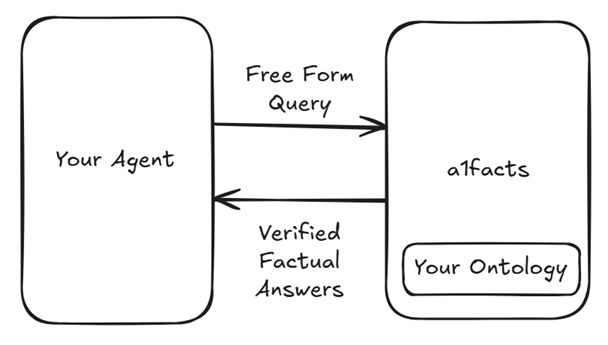
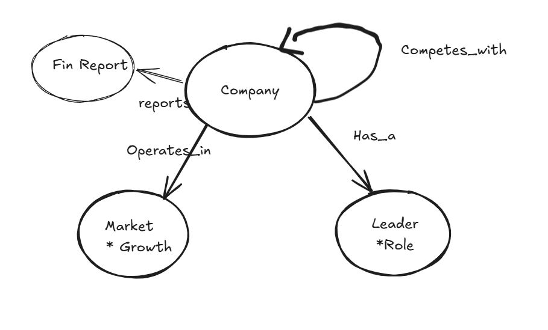
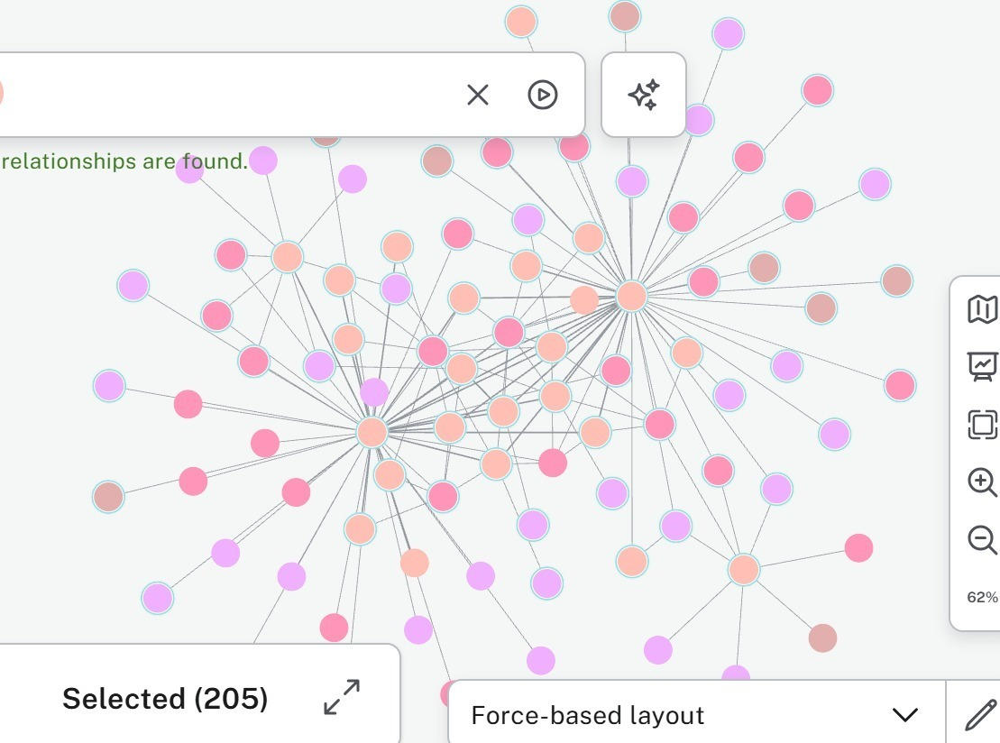
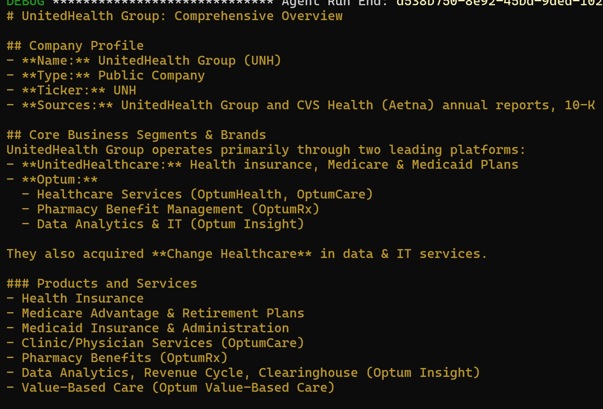

# A1C: An Ontology-Driven Knowledge Graph System

A1C is a powerful Python framework for building and interacting with knowledge graphs. It allows you to define a clear structure (ontology) for your data, ingest information from various sources, and use natural language to get precise, reliable answers. By grounding your AI agents in a structured knowledge graph, A1C helps eliminate hallucinations and ensures that your agent's responses are based on verified facts.

This project uses a Neo4j backend to manage and query the graph data, providing a robust and scalable solution for your knowledge management needs.



## Key Features

-   **Ontology-Driven**: Define your knowledge domain with simple YAML files. A1C uses this ontology to automatically create the tools and structures needed to interact with your data.
-   **Structured Data Ingestion**: Convert unstructured text into structured entities and relationships within your knowledge graph, ensuring data quality and consistency.
-   **Natural Language Queries**: Ask questions in plain English. A1C translates your queries into precise graph traversals to retrieve the information you need.
-   **Reliable AI Agents**: Build AI agents that can provide accurate and trustworthy answers by grounding them in the factual data of the knowledge graph.
-   **Neo4j Backend**: Utilizes the power of Neo4j for efficient storage and complex querying of your knowledge base.

## Usage Scenario: Building AI Agents with Precise Answers

In many applications, it's critical for AI agents to provide answers that are not just plausible but also precise and factually correct. Standard large language models (LLMs) can sometimes "hallucinate" or generate incorrect information, which can be a major issue in domains like finance, legal, or scientific research.

A1C addresses this problem by grounding your AI agent in a knowledge graph. Here's how it works:

1.  **Define Your Domain**: You start by creating an ontology that describes the key concepts and relationships in your specific domain. For example, in finance, you might define entities like `Company`, `Product`, and `Market`, and relationships like `competes_with` or `operates_in`.

    

2.  **Populate the Graph**: You then ingest data from reliable sources into the knowledge graph. This could be from internal documents, databases, or external APIs. A1C ensures that this data is structured according to your ontology.

    

3.  **Query with Confidence**: When your AI agent receives a question, it doesn't just rely on its internal training data. Instead, it uses A1C to query the knowledge graph. This means the agent's answers are based on the structured, verified data you've provided.

    

By using A1C, you can build an AI agent that is not only intelligent but also trustworthy, providing precise and reliable answers every time.

## Getting Started

Follow these steps to get the A1C Knowledge Graph running on your local machine.

### Prerequisites

-   Python 3.13+
-   [uv](https://github.com/astral-sh/uv) - An extremely fast Python package installer.
-   A running Neo4j Database instance.

### Installation

1.  **Clone the repository:**
    ```bash
    git clone https://github.com/shadi-fsai/a1c.git
    cd a1c
    ```

2.  **Create a virtual environment and install dependencies:**
    ```bash
    # Create the virtual environment
    uv venv
    
    # Activate the virtual environment
    # On Windows: .venv\Scripts\activate
    # On macOS/Linux: source .venv/bin/activate
    .venv\Scripts\activate

    # Install dependencies
    uv pip install -e .
    ```

### Configuration

You'll need to provide credentials to connect to your Neo4j database and other services.

1.  Create a `.env` file in the root of the project.
2.  Add your API keys and Neo4j credentials to the file:
    ```
    OPENAI_API_KEY="your_openai_api_key"
    EXA_API_KEY="your_exa_api_key"
    NEO4J_URI="bolt://localhost:7687"
    NEO4J_AUTH="your_neo4j_password"
    ```

## Cookbook

The `cookbook/` directory contains practical examples of how to use A1C.

The `cookbook/example/` directory shows how to build a financial analyst agent that can answer questions about companies. To run this example, navigate to the directory and run:

```bash
python cookbook/example/infoagent.py
```

You can modify this script to experiment with different data, queries, or other functionalities of the knowledge graph.
